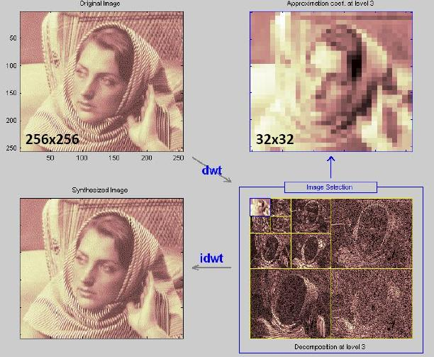

```{r setup, include=FALSE}
knitr::opts_chunk$set(echo = TRUE)
library(kableExtra)
```

## Models

#### Discrete Wavelet Transform (DWT)

DWT is widely used in signal processing, especially in image signal processing. The compression image formatting JPEG-2000 is based on DWT. Compared to Fourier transform, wavelet transform captures both frequency and location information. Below is a result of a wavelet transform showing how it works.

####

Therefore, I wonder if DWT can be used to detect seasonalities and cycles, and attribute returns to different lengths of seasonalities.

#### Principle Component Analysis (PCA)

PCA is the most popular algorithm among all the methods introduced in this article. It is used to identify the uncorrelated factors behind the signals. One can usually find practical justifications for low-order principle components.


#### Independent Component Analysis (ICA)

ICA is the most promissing algorithm in speech signal processing before DNN dominates this field. It comes from a simple but genius idea: reverse application of central limit theorem. It was first introduced to seperate voices of two different speakers. Detailed description of this algorithm can be found in [[1]](/ICA.pdf). ICA is very similar to PCA. The key point of ICA different with PCA is that it assumes that the components are mutually independent (Any order moment is 0, not just uncorrelated) and are marginally non-Gaussian distributed. Under this assumption, however, it is much harder to find practical justifications than PCA does.

#### Kalman Filter

Kalman filter is widely used in signal processing such as signal prediction and smoothing given very little prior information. In our case, with more than 500 dimensions of every states, it is really hard to use ordinary regression because of the rank deficiency at beginning. The Kalman filter, however, can give estimates at very beginning and quickly converges to the BLUE estimator. There are many derivatives of Kalman filter, such as Extended KF and Unscented KF. Adaptive KF is used in this project. The methodology can be found in [[2]](/Improving Adaptive Kalman Estimation in GPSINS Int.pdf), [[3]](/Market Risk Beta Estimation using Adaptive Kalman Filter.pdf).

## Applications

#### Discrete Wavelet Transform (DWT)


#### Principle Component Analysis (PCA)

PCA is mostly used in finding underlying factors. In our case, it can also be used to deal with the high dimensional problem, namely the number of variables exceeding the number of obeservations, which leads to singular matrix in calculation. It is not perfect solution however, since it losses information when doing dimension reduction.
```{r}

index = 141
Ret = readRDS("Ret.RDS")

nObs = nrow(Ret)
# nObs = 2620
RetData = Ret[,-1]
nVar = ncol(RetData)-1
inSample = round(nObs/2)
outSample = nObs - inSample
# hc = hclust(dist(t(RetData)))
corr = rep(NA,ncol(RetData))
for (i in 1:ncol(RetData)) {
  df = merge(x = Ret[1:inSample,c(1,index+1)], y = Ret[1:inSample,c(1,i+1)], by = "date")
  df = df[complete.cases(df),]
  scaler = nrow(df)/inSample
  if (scaler>0) {
    corr[i] = cor(df[,2],df[,3])*scaler
  }
}
# picked = order(-corr)[2:11]
r = RetData[1:inSample,]
r = r[ , colSums(is.na(r)) == 0]
r = as.matrix(r)
m = colMeans(r)
r = sweep(r,2,m)
c = cov(r)
e = eigen(c)
# RetData[is.na(RetData)] = 0
# e0 = eigen(cov(RetData))
loadings = sweep(e$vectors,2,sqrt(e$values),"*")
PCs = r%*%loadings
w = solve(loadings)
# PCs = sweep(PCs,2,sqrt(e$values),"*")
# w = solve(sweep(e$vectors,2,sqrt(e$values),'*'))
PCs_tr = apply(PCs,2, function(x) cumprod(1+x))
PCs_tr = as.data.frame(PCs_tr)
PCs_tr = cbind.data.frame(Ret$date[1:inSample],PCs_tr)
colnames(PCs_tr)[1] = "date"


# pca = prcomp(r)
ExpPwr = e$values/sum(e$values)
cumExpPwr = cumsum(ExpPwr)
PCA_stat = data.frame(PCs = 1:length(e$values),
                      "Marginal Explaining Power" = ExpPwr, 
                      "Cumulative Explaining Power" = cumExpPwr)

library(reshape2)
PCA_stat_scaled = PCA_stat
PCA_stat_scaled$Marginal.Explaining.Power = PCA_stat_scaled$Marginal.Explaining.Power*4
PCA_stat_melted = melt(PCA_stat_scaled, id = "PCs")

ggplot(PCA_stat_scaled,aes(x = PCs)) +
  geom_bar(aes(y = Marginal.Explaining.Power, colour = "Marginal Explaining Power"),
           stat = "identity",alpha = 0.4) +
  geom_line(aes(y = Cumulative.Explaining.Power, colour = "Cumulative Explaining Power")) +
  scale_y_continuous("Cumulative", sec.axis = sec_axis(~./4, name = "Marginal"))

PC5 = PCs_tr[,1:6]
colnames(PC5)[2:6] = c("PC1","PC2","PC3","PC4","PC5")

PC5_melted = melt(PC5, id = "date")
ggplot(data = PC5_melted,
       aes(x = date, y = value, colour = variable)) +
  geom_line()

w5 = w[1:5,]
r_est = PCs[,1:5]%*%w5
e = abs(r[inSample,] - r_est[inSample,])
PCA_pred = data.frame(stock = 1:ncol(r),
                      "return at t" = r[inSample,], 
                      "estimate at t" = r_est[inSample,], 
                      "error at t" = e)
PCA_pred_melted = melt(PCA_pred[,1:3],id = "stock")
ggplot(data = PCA_pred_melted,
       aes(x = stock, y = value, colour = variable)) +
  geom_line()
ggplot(data=PCA_pred_melted, aes(x=stock, y=value, fill=variable)) +
  geom_bar(stat="identity", position=position_dodge()) + theme_bw()
ggplot(PCA_pred, aes(x=error.at.t)) + 
  geom_histogram(color="black", fill="white",bins=40) + theme_bw()+
  geom_density(alpha=.2, fill="#FF6666") +
  geom_vline(aes(xintercept=mean(error.at.t)), color="blue", linetype="dashed", size=1)
```


#### Independent Component Analysis (ICA)

#### Kalman Filter

In this part, all stock data in the S&P 500 universe is used for estimate the stock return of MMM. As the result has shown below, it seems that Kalman filter can provide a very accurate posteriori estimate and good one step prediction. There is one concern that the model's accuracy to some degree relies on the initial values of Q, the covariance matrix of state transition noise, and R, the variance of estimate noise. Adaptive Kalman filter is designed to eliminate the influence of inaccurate initial values of Q and R. In our case, however, it does not work well given the fact that these noises are not necessarily jointly Gaussian distributed. If they are not, one of the basic assumptions of Kalman filter including adaptive Kalman filter is violated.

```{r, echo=FALSE}
library(ggplot2)
library("reshape2")
results = readRDS("KF.RDS")
r_rpost <- melt(results[,c(1,2,4)], id="date")  # convert to long format
r_rprior <- melt(results[,c(1,2,3)], id="date")  # convert to long format
e <- melt(results[,c(1,5,6)], id="date")  # convert to long format

ggplot(data=r_rpost,
       aes(x=date, y=value, colour=variable)) +
  geom_line(alpha = 0.5) +
  ggtitle("Actual Return VS Posteriori Estimate") +
  ylab("return")

ggplot(data=r_rprior,
       aes(x=date, y=value, colour=variable)) +
  geom_line(alpha = 0.5) +
  ggtitle("Actual Return VS Priori Estimate (Prediction)") +
  ylab("return")

ggplot(data=e,
       aes(x=date, y=value, colour=variable)) +
  geom_line(alpha = 0.5) +
  ggtitle("Priori Error VS Posteriori Error") +
  ylab("error")
```

```{r, echo=FALSE}
kf_stat = data.frame("Prior MSE" = mean(results$err_prior),
                     "Std.Dev of Priori MSE" = sd(results$err_prior),
                     "Posteri MSE" = mean(results$err_post),
                     "Std.Dev of Posteri MSE" = sd(results$err_post))
rownames(kf_stat) = "Kalman Filter Estimates"
kf_stat = format(kf_stat, digits = 3)
# kable(kf_stat)
kable(kf_stat) %>%
  kable_styling(full_width = F, bootstrap_options = "condensed")
```

